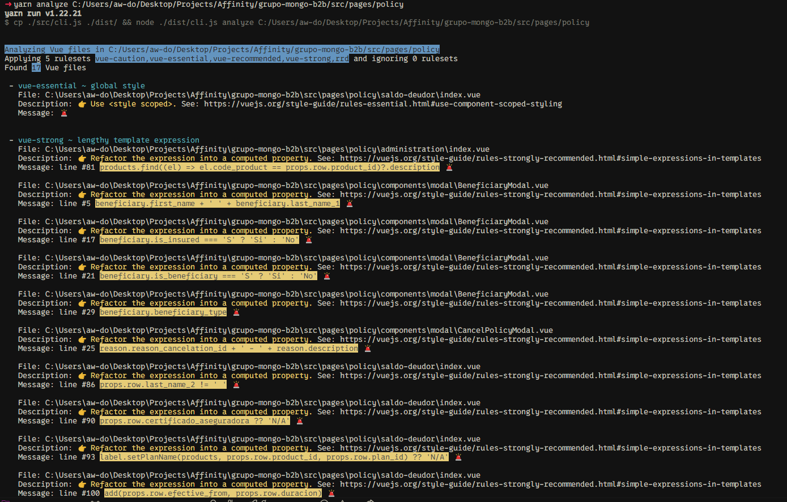
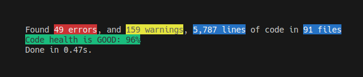

# Vue Mess Detector

A comprehensive code analysis and quality assessment tool that provides actionable insights into code health, helping developers identify and resolve potential issues in Vue.js and Nuxt.js projects.

## 👥 Core Team

<table>
  <tr>
    <td align="center" style="border: none;">
      <a href="https://github.com/rrd108">
        
        <br />
        <sub><b>rrd</b></sub>
      </a>
    </td>
    <td align="center" style="border: none;">
      <a href="https://github.com/David-Pena">
        
        <br />
        <sub><b>David Pena</b></sub>
      </a>
    </td>
  </tr>
</table>

## ⬇️ Installation

### From npm registry

```bash
# using pnpm
pnpm add vue-mess-detector -D

# using yarn
yarn add vue-mess-detector -D

# using npm
npm install vue-mess-detector --save-dev

# using bun
bun add @rrd/vue-mess-detector --dev
```

### From JSR registry

```bash
# using deno
deno add @rrd/vue-mess-detector

# using pnpm
pnpm dlx jsr add @rrd/vue-mess-detector -D

# using yarn
yarn dlx jsr add @rrd/vue-mess-detector -D

# using npm
npx jsr add @rrd/vue-mess-detector --save-dev

# using bun
bunx jsr add @rrd/vue-mess-detector --dev
```

## 📦 Integrations

- [Vscode extension](https://marketplace.visualstudio.com/items?itemName=WebMania.vue-mess-detector)
- [Nuxt devtools](https://github.com/rrd108/vue-mess-detector-nuxt-devtools)
- Vue devtools (in progress)
- Github Action (in progress)

## ⚙️ Usage

Basic usage:

```bash
npx vue-mess-detector analyze [path]
```

Options:

| Option      | Description                                             | Default | Example                                                |
| ----------- | ------------------------------------------------------- | ------- | ------------------------------------------------------ |
| `[path]`    | Specify directory or file to analyze                    | `./src` | `./src/components/AppHeader.vue` |
| `--exclude` | Exclude directories or files (comma-separated, supports wildcards) | None      | `--exclude=components,Gauranga.vue,*.test.ts`  |
| `--apply`   | Apply **only** specific rulesets or rules (comma-separated) | All rules | `--apply=vue-essential,magicNumbers`        |
| `--ignore`  | Ignore **only** specific rulesets or rules (comma-separated) | -    | `--ignore=vue-caution,functionSize`                    |
| `--group`   | Group results by `file` or `rule`                       | `rule`  | `--group=file`                                         |
| `--sort`   | Order results `asc` or `desc`                         | `asc`   | `--sort=desc`                                         |
| `--level`   | Show only specific level `error` or all         | all    | `--level=error`                                        |
| `--output`  | Output format `text` or `table` or `json`               | `text`  | `--output=table`                                        |
| `--file-output`  | The name of the file to save output to               | None  | `--file-output=analysis.txt`                            |


If you want to store your flags in a configuration file, you can create a `vue-mess-detector.json` file in the root of your project with the following content:

```json
{
  "apply": "vue-strong,rrd",
  "level": "error"
}
```

You can override the limits set for `functionSize` and `scriptLength` rules using our new `override` field in the json file:

```json
{
  // other flags
  "override": {
    "maxFunctionSize": 20, // default value
    "maxScriptLength": 100 // default value
  }
}
```

Then you can run the command without flags:

```bash
npx vue-mess-detector analyze
```

All flags will be read from the configuration file. All missing flags will be set to their default values except if you provide them as flags in the command line.

## 📊 Example output

#### Without `--group` flag (default behavior is to group per rule) ⬇️



#### With `--group=file` flag ⬇️


## 🧾 Output explanation

**Group by Rule:** In this view, the first line is highlighted in blue, representing the rule being evaluated. Following this, you'll see blocks of information structured as follows: file path, description, and message.

**Group by File:** In this view, the first line displays the file path being evaluated. Below this, you'll see blocks of information with the following structure: rule, description, and message.

- **Rule**: The blue line that defines the specific rule being evaluated.
- **File**: Shows the path to the file where the rule is applied.
- **Description**: A concise explanation of the rule, often accompanied by a link to relevant documentation for further details.
- **Message**: Indicates the line of code where the rule was violated.

> [!IMPORTANT]
> Yellow messages are warnings, suggesting best practices, while red messages highlight errors that must be corrected.

## 📈 Code Health



According to the number of errors and warnings, and the lines of code in your project, we calculate a health score for your project.

The code health is:

- **low** if the score is under 75%
- **medium** if the score is between 75% and 85%
- **ok** if the score is between 86% and 95%
- **good** if the score is above 95%

## 📚 Documentation

> 👉 For more information, see the [documentation](https://vue-mess-detector.webmania.cc/).

## 👥 Discord Server
👉 Join our [discord server](https://discord.gg/nXKwzk97jn)

## 🤝 How to contribute?

See [CONTRIBUTING.md](https://github.com/rrd108/vue-mess-detector/blob/main/CONTRIBUTING.md) file.

## 🚀 PKG:PREVIEW Continuous Releases

We use [pkg.pr.new](https://github.com/stackblitz-labs/pkg.pr.new) for continuous releases. This allows contributors and users to test new features and bug fixes immediately, without waiting for official releases.

### How it works:

1. Each commit and pull request triggers an instant preview release.
2. These preview releases are published to a temporary registry, not to NPM.
3. You can access and test these preview releases using special URLs.

### Using a preview release:

To use a preview release, install it using the following format:

```
yarn add https://pkg.pr.new/rrd108/vue-mess-detector/vue-mess-detector@{commit-hash}
```

Replace `{commit-hash}` with the actual commit hash you want to test.

This feature enables faster feedback loops and helps
